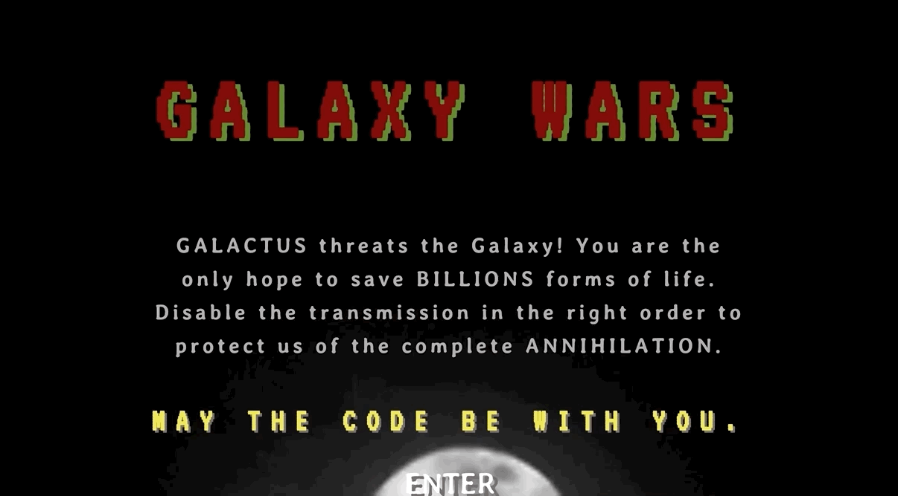
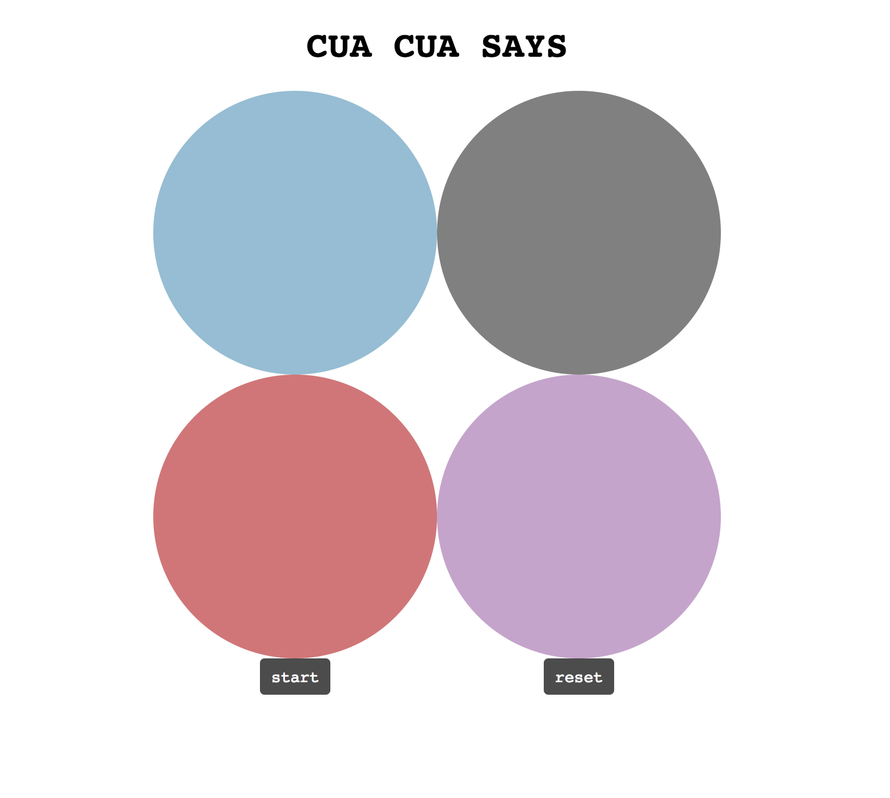

# General Assembly WDI Project 1: Galaxy Wars

[GitHub Pages](http://fuyinghuang.com/wdi-project-one-galaxy-wars/)

[GitHub Repo](https://github.com/huangfuin1101/wdi-project-one-galaxy-wars/tree/master)

Galaxy Wars is memory game based on the concept of "Simon Says". Playing the game has both fun and the awareness of protecting the living environment.

Galaxy Wars is my first project of Web Development Immersive in General Assembly. It is my first game built individually with the practice of HTML, CSS and JavaScript.

## Landing Page



## Play the Game


## Game Over


## Technologies Used

* Git
* GitHub
* HTML5 with HTML5 audio
* CSS3 with animation
* JavaScript (ECMAScript 6)
* Google Fonts

### Functionality

#### Four circles

I worked on four circles with two buttons at the beginning. Each circle is a div. By assigning each colour a number, randomly generates different amount of number each time with sound and compare the order of the circle clicked buy used.  



### Featured Piece of Code
This lets the chosen circle change colour by DOM elements. In order to make the circle lighting one by one, I assign setTimeout function within another setTimeout function. From [script.js](https://github.com/huangfuin1101/wdi-project-one-galaxy-wars/blob/master/script.js).

```JavaScript
function lightCircle() {
  computerSequence.forEach((color, index) => {
    const time = (index * 1000) + 1200;
    setTimeout(() => {
      if(color === 'blue') {
        blue.style.opacity = '0.25';
        setTimeout(() => {
          blue.style.opacity = '1';
          audio1.play();
        }, 300);
      }
      if(color === 'green') {
        green.style.opacity = '0.25';
        setTimeout(() => {
          green.style.opacity = '1';
          audio1.play();
        }, 300);
      }
      if(color === 'yellow') {
        yellow.style.opacity = '0.25';
        setTimeout(() => {
          yellow.style.opacity = '1';
          audio1.play();
        }, 300);
      }
      if(color === 'red') {
        red.style.opacity = '0.25';
        setTimeout(() => {
          red.style.opacity = '1';
          audio1.play();
        }, 300);
      }
    }, time);
  });
}
```

## Wins and Blockers
As my first project, I would say a huge win was to build the game and used HTML, CSS and JavaScript I have learned so far. The styling was another big win by using the gif background image of the planet, which made the four circles as part of the space.

The biggest block was to let the four circles lighting one after another instead of lighten at the same time, which was quite challenging at the beginning. I couldn't just use setTimeout function which the four circles would still lighten at the same time.

### Styling
Initially, I made four colourful circles for the game and then I switched to the outer space style, with four rotating plants by using CSS animation. From style.css

### Future Features
There are some features I would like to add in the future:
* Adding more audios, different circles will play different sound when chosen.  
* Creating a score board to keep tracking number of user clicks.
* Set different levels, time will decrease each level.
* Two player mode, so two user can compete with each other.
